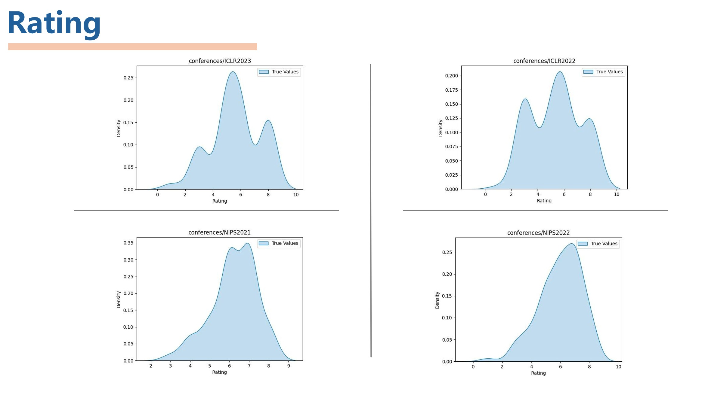

# Apache-Conferences-Dataset
Apache format dataset of AI/DL/ML conferences, including paper abstracts, info and reviewers' ratings. We use it for idea quality measuring and idea proposing. See the [Idea king project](https://github.com/frinkleko/Critic-IdeaKing), where we aims to explore the capabilities of large language models (LLMs) in scoring research papers and generating ideas.

## Format

We organize reviews of papers in famous AI/DL/ML conferences and parser them into standard Apache format for downstream tuning. The task is designed for rating regression.

Here is one conversation example:

```Json
  {
    "instruction": "You are an AI journal conference reviewer from openreview. You need to read the abstract of a paper and then review the paper as a reviewer to give a rating on the IDEA or other metrics. You need to grade like a real reviewer as follows MarkDown format:\n\n    # Review\n\n    ## Summary\n\n    ## Soundness\n\n    ## Presentation\n\n    ## Contribution\n\n    ## Strengths\n\n    ## Weaknesses\n\n    ## Rating\n\n    ## Questions\n\n    ## Suggestions, Ideas, and Comments\n\n    ## Limitations\n\n    ## Ethics Review\n\n    ## Confidence\n\n    Review the following paper's abstract and provide feedback.\n[Abstract]:\n",
    "input": "We present Sequential Neural Variational Inference (SNVI), an approach to perform Bayesian inference in models with intractable likelihoods. (Paper abstarct)",
    "output": "# Review\n\n## Summary_of_the_paper\nThis paper presents SNVI, a simulation-based inference based....\n\n\n## Main_review\nStrengths:\n- This work solves a quite practical problem of SNLE and SNRE...\n\nWeaknesses:\n- Figure 8 is meant to show results for SNRE and SNRVI, ....\n\n## Summary_of_the_review\n...\n\n## Correctness\n4: ....\n\n## Technical_novelty_and_significance\n2: ....\n\n## Empirical_novelty_and_significance\n3: ...\n\n## Recommendation\n8: accept, good paper\n\n## Confidence\n4: ...",
    "system": "You are an AI journal conference reviewer from openreview. Review the following paper's abstract and provide feedback.",
    "history": []
  },
```

## Included Conferences

Currently, we include the following conferences in our dataset, we will continually add more datasets and release the codes about crawling.

| Conferences                          | Total conversations |
| ------------------------------------ | ------------------- |
| [ICLR 2022](./data/ICLR2022.json)    | 10,210              |
| [ICLR 2023](./data/ICLR2023.json)    | 14,359              |
| [NeurIPS 2021](./data/NIPS2021.json) | 10,729              |
| [NeurIPS 2022](./data/NIPS2022.json) | 13,157              |
| [NeurIPS 2023](./data/NIPS2023.json) | 15,175              |

### Ratings Distribution

We also plot the rating distribution of each conference.



## Raw results

We also release the raw collections of papers and reviews, which is in openreview like format. You can find one example [here](./raw_data/example.json).

Full raw data can be downloaded from [./raw_data](./raw_data).
| Conferences                                               |
| --------------------------------------------------------- |
| [ICLR 2022](./raw_data/ICLR.cc_2022_Conference.zip)       |
| [ICLR 2023](./raw_data/ICLR.cc_2023_Conference.zip)       |
| [NeurIPS 2021](./raw_data/NeurIPS.cc_2021_Conference.zip) |
| [NeurIPS 2022](./raw_data/NeurIPS.cc_2022_Conference.zip) |
| [NeurIPS 2023](./raw_data/NeurIPS.cc_2023_Conference.zip) |

## Build from Scratch

We provide the code for processing the raw data and generating the Apache format dataset. You can find the code in [./code](./code).

After you unzip the raw data, for example, you have `./raw_data/NeruIPS.cc_2021_Conference`, you can run the following command to generate the Apache format dataset.

```bash
python code/process.py --root_folder_path ./raw_data/NeruIPS.cc_2021_Conference
```
